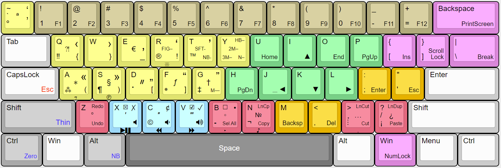

# Емулятор 60-відсоткової клавіатури

Цей [AutoHotkey](https://autohotkey.com/) скрипт призначений для емуляції 60-відсоткової клавіатури за допомогою будь-якої традиційної клавіатури.

Він перепризначає клавіші так, що навігаційні та допоміжні клавіші стають доступними з основного буквенно-цифрового блоку.

Таким чином, ви зможете протестувати — чи буде вам зручно працювати на 60-ти відсотковій клавіатурі.

Крім перепризначення навігаційних клавіш додаються також деякі додаткові можливості.

Наприклад, ось так виглядає перший шар із перепризначеними клавішами:

Докладніше все це описано в наступних статтях:
- [Как попробовать 60-процентную клавиатуру, если у вас её нет](https://habr.com/ru/post/659063/)
- [Типографская раскладка для 60-процентной клавиатуры](https://habr.com/ru/post/659471/)
- [Типографская раскладка для 60-процентной клавиатуры. Часть 2 (буде додано після публікації статті)](https://habr.com/ru/post/659693/)

# Що з цим робити

Файли скриптів знаходяться в папкі «Scripts». Головний (стартовий) скрипт — Sukhe_60_percent_keyboard_emulator.ahk

Для автоматичного запуску скрипта під час входу в облікову запись, зробіть наступне:
1. Інсталюйте [AutoHotkey](https://autohotkey.com/)
2. Створіть ярлик, вказуючий на стартовий скрипт 
3. Перемістіть ярлик в стартову папку (%appdata%\Microsoft\Windows\Start Menu\Programs\Startup)

Наприклад в папку C:\Users\MyName\AppData\Roaming\Microsoft\Windows\Start Menu\Programs\Startup

Для безпосереднього запуску скрипта:
1. Інсталюйте [AutoHotkey](https://autohotkey.com/)
2. Двічи клацніть по файлу скрипта в провіднику Windows
