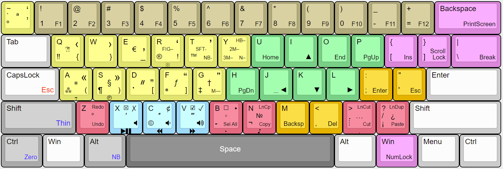

# 60 percent keyboard emulator

This [AutoHotkey](https://autohotkey.com/) script is designed to emulate a 60% keyboard with any regular keyboard.

It remaps the keys so that the navigation and auxiliary keys are available from the main alphanumeric block.

Thus, you can test whether you will be comfortable working on a 60% keyboard.

In addition to remapping navigation keys, some additional features become available.

For example, this is what the first layer with remapped keys looks like:

The script features are described in more detail in the following articles:
- [Как попробовать 60-процентную клавиатуру, если у вас её нет](https://habr.com/ru/post/659063/)
- [Типографская раскладка для 60-процентной клавиатуры](https://habr.com/ru/post/659471/)
- [Типографская раскладка для 60-процентной клавиатуры. Часть 2](https://habr.com/ru/post/659693/)

# How it works

Script files are located in the ‘Scripts’ folder. The main (start) script is Sukhe_60_percent_keyboard_emulator.ahk

To run this script automatically after user login, follow these steps:
1. Install [AutoHotkey](https://autohotkey.com/)
2. Create shortcut of this script
3. Move shortcut to startup folder (%appdata%\Microsoft\Windows\Start Menu\Programs\Startup)

For example — C:\Users\MyName\AppData\Roaming\Microsoft\Windows\Start Menu\Programs\Startup

For immediately script start:
1. Install [AutoHotkey](https://autohotkey.com/)
2. Double click on this file in the explorer

If the script doesn't run, try using AutoHotkey64_UIA.exe instead of AutoHotkey.exe